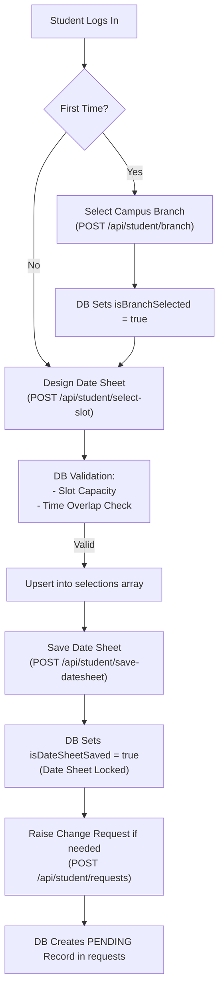
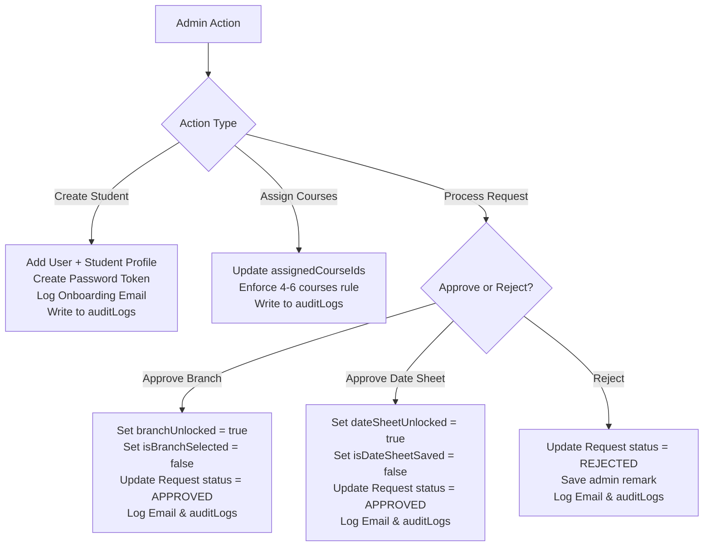

# ExamSlot Portal — Database Storage & Request Workflow Guide

This document provides a comprehensive, end-to-end breakdown of how data is stored, updated, and synchronized in the **ExamSlot** database whenever a **Student (User)**, **Admin**, or **AI Assistant** performs any action or submits any request on the portal.

---

## 1. Database Architecture & Dual-Layer Persistence

ExamSlot uses a **resilient dual-layer persistence system** designed for zero latency and high availability:

```
                  ┌─────────────────────────────────────────┐
                  │          HTTP API / Server Layer        │
                  │              (server.ts)                │
                  └────────────────────┬────────────────────┘
                                       │
                    ┌──────────────────┴──────────────────┐
                    ▼                                     ▼
      ┌───────────────────────────┐         ┌───────────────────────────┐
      │   Synchronous File DB     │         │   Asynchronous Supabase   │
      │       (data/db.json)      │         │      (PostgreSQL)         │
      │   Primary Low-Latency     │         │   Cloud Managed Database  │
      └───────────────────────────┘         └───────────────────────────┘
```

1. **Synchronous Local File Database (`data/db.json`)**:
   - Acts as the primary operational database for instant read/write operations during API handling.
   - Automatically re-seeded and validated upon application startup via `initDb()`.
2. **Cloud Managed Database (Supabase PostgreSQL)**:
   - Asynchronous background sync via `syncRecordToSupabase()` and `syncLoadedDbToSupabase()`.
   - Uses Row-Level Security (RLS) and PostgreSQL tables matching the exact structure of the file DB.

---

## 2. Complete Database Tables & Schema Overview

| Database Table / Key | Description | Primary Fields Stored |
| :--- | :--- | :--- |
| **`users`** | User authentication credentials & roles | `id`, `email`, `passwordHash`, `role` (`ADMIN`/`STUDENT`), `createdAt`, `updatedAt` |
| **`sessions`** | Active user bearer tokens | `token`, `userId`, `email`, `role`, `lastActive` |
| **`passwordTokens`** | Single-use password setup & reset tokens | `id`, `userId`, `email`, `token`, `expiresAt`, `isUsed`, `createdAt` |
| **`branches`** | Exam center campuses | `id`, `code`, `name`, `city`, `address`, `contactNumber`, `status` (`ACTIVE`/`INACTIVE`) |
| **`courses`** | University courses | `id`, `code`, `title`, `creditHours`, `department`, `status` (`ACTIVE`/`INACTIVE`) |
| **`students`** | Complete student profiles | `id`, `userId`, **Personal Group** (name, phone, CNIC, DOB, gender, address), **Parent Group** (father name, parent CNIC, occupation, phone, emergency contact), **Academic Group** (reg number, program, semester, batch, CGPA, assigned course IDs), **State Flags** (`isBranchSelected`, `isDateSheetSaved`, `branchUnlocked`, `dateSheetUnlocked`) |
| **`slots`** | Exam timetable slots | `id`, `courseId`, `courseCode`, `courseTitle`, `examDate`, `startTime`, `endTime`, `capacity` |
| **`selections`** | Student course-to-slot bookings | `id`, `studentId`, `courseId`, `slotId`, `createdAt` |
| **`requests`** | Student change requests | `id`, `studentId`, `studentName`, `studentEmail`, `regNumber`, `requestType` (`CHANGE_BRANCH`/`CHANGE_DATESHEET`), `reason`, `status` (`PENDING`/`APPROVED`/`REJECTED`), `adminRemark`, `dateRaised`, `resolvedAt` |
| **`auditLogs`** | Immutable admin audit trail | `id`, `adminEmail`, `action`, `target`, `details`, `timestamp` |
| **`emails`** | Outbound system notification log | `id`, `to`, `subject`, `body`, `link`, `type`, `timestamp`, `read` |

---

## 3. Deep Dive: Admin Management vs. `users` & `students` Operating Mechanics

### 3.1 How Admin is Managed in the Database

1. **Single Source of Truth (`users` table)**:
   - Administrators exist **exclusively** inside the `users` table/collection with `role = 'ADMIN'`.
   - Admin user record structure:
     ```json
     {
       "id": "user-admin-1",
       "email": "admin@examslot.edu",
       "passwordHash": "$2a$10$wK1...",
       "role": "ADMIN",
       "createdAt": "2026-10-09T16:00:00.000Z",
       "updatedAt": "2026-10-09T16:00:00.000Z"
     }
     ```
2. **No Student Profile Entry**:
   - Admins **do not have** an entry in the `students` (`student_profiles`) table.
   - The `students` table is strictly reserved for student profiles (reg number, program, semester, CGPA, branch choice, date sheet locks).
3. **Session & Middleware Authorization**:
   - When an admin logs in via `POST /api/auth/login`, bcrypt verifies the password hash against `users`.
   - A session record `{ token, userId, email, role: 'ADMIN', lastActive }` is saved to `sessions` array and `activeSessions` memory map.
   - Every admin route is protected by `adminOnly` middleware (`server.ts`), which checks `req.user.role === 'ADMIN'`. Non-admins receive HTTP 403 Forbidden.
4. **Audit Logging for Admin Actions**:
   - Whenever an Admin creates, updates, or deletes any entity (student, branch, course, slot) or approves/rejects a change request, the action is logged to `auditLogs`:
     ```json
     {
       "id": "audit-1775734800-xy",
       "adminEmail": "admin@examslot.edu",
       "action": "APPROVE_REQUEST",
       "target": "Fatima Noor (BC210402011)",
       "details": "Approved branch change request per university transfer policy.",
       "timestamp": "2026-10-09T16:25:00.000Z"
     }
     ```

---

### 3.2 How `users` and `students` Tables Operate & Relate

```
┌──────────────────────────────────────┐                   ┌───────────────────────────────────────────────────┐
│               users                  │                   │                     students                      │
├──────────────────────────────────────┤                   ├───────────────────────────────────────────────────┤
│ id (PK, String / UUID)               │◄──── 1 : 1 ───────│ id (PK, String / UUID)                            │
│ email (String, Unique)               │                   │ userId (FK -> users.id, Unique)                   │
│ passwordHash (String / nullable)     │                   │ fullName, phone, cnic, dob, gender, address       │
│ role ('ADMIN' | 'STUDENT')           │                   │ fatherName, parentCnic, occupation, emergency... │
│ createdAt, updatedAt (ISO Strings)   │                   │ regNumber (Unique), program, semester, batch, cgpa│
└──────────────────────────────────────┘                   │ isBranchSelected, isDateSheetSaved (Booleans)     │
                                                           │ branchUnlocked, dateSheetUnlocked (Booleans)      │
                                                           │ assignedCourseIds (Array of Strings)              │
                                                           └───────────────────────────────────────────────────┘
```

1. **Architectural Separation of Concerns**:
   - **`users` Table (Authentication & Security)**: Handles login identity, credentials (`email`, `passwordHash`), user role (`ADMIN` vs `STUDENT`), and timestamp metadata.
   - **`students` Table (Domain Application Profile)**: Holds personal, parent, and academic data, state machine lock flags, and assigned course IDs.
2. **1-to-1 Foreign Key Link (`students.userId -> users.id`)**:
   - Each `StudentProfile` record links back to a single `User` via `userId`.
   - In Supabase SQL schema: `user_id UUID UNIQUE REFERENCES public.users(id) ON DELETE CASCADE`.
3. **Student Account Creation Flow**:
   - Admin triggers `POST /api/admin/students`.
   - Step A: Insert record into `users` (`role: 'STUDENT'`, `passwordHash: null`).
   - Step B: Insert record into `students` with `userId = users.id`.
   - Step C: Generate 24h onboarding token in `passwordTokens`.
   - Step D: Log account setup email in `emails`.
4. **State Machine Flags inside `students`**:
   - `isBranchSelected` (boolean): `false` initially -> `true` after selecting a campus branch once.
   - `isDateSheetSaved` (boolean): `false` initially -> `true` after finalizing slot bookings (locks the date sheet).
   - `branchUnlocked` & `dateSheetUnlocked` (booleans): Single-use unlock flags set to `true` when Admin approves a student's `ChangeRequest`.
   - `assignedCourseIds` (string array): Admin-assigned course IDs (enforced 4 to 6 courses).
5. **Cascading Cleanup on Deletion**:
   - Deleting a student (`DELETE /api/admin/students/:id`) removes both the `students` profile and the linked `users` record, and automatically deletes matching entries in `selections`, `requests`, and `passwordTokens`.

---

## 4. Workflow 1: Student (User) Actions & Database Flow



### 4.1 Login & Session Storage
- **Trigger**: `POST /api/auth/login`
- **What gets stored**:
  1. The server checks `users` array for matching `email` and verifies `passwordHash` using bcrypt.
  2. Generates a 32-byte hex token.
  3. Inserts session into `sessions` array in `db.json` and updates `activeSessions` map in memory:
     ```json
     {
       "token": "e4a5f...39b",
       "userId": "user-stu-1",
       "email": "ali.khan@student.examslot.edu",
       "role": "STUDENT",
       "lastActive": 1775734200000
     }
     ```
  4. Auto-refreshes `lastActive` on subsequent requests (24-hour sliding expiration window).

### 4.2 Setting / Resetting Password
- **Trigger**: `POST /api/auth/forgot-password` & `POST /api/auth/reset-password`
- **What gets stored**:
  1. Old unused tokens in `passwordTokens` marked `isUsed = true`.
  2. New token created in `passwordTokens`:
     ```json
     {
       "id": "token-1775734200-ab12",
       "userId": "user-stu-1",
       "email": "ali.khan@student.examslot.edu",
       "token": "9f82e...11c",
       "expiresAt": "2026-10-10T16:00:00.000Z",
       "isUsed": false,
       "createdAt": "2026-10-09T16:00:00.000Z"
     }
     ```
  3. System appends onboarding email record into `emails`.
  4. On reset submission, token marked `isUsed = true` and `users.passwordHash` updated.

### 4.3 One-Time Branch Selection
- **Trigger**: `POST /api/student/branch`
- **Backend Rules**:
  - Allowed **only once** unless `student.branchUnlocked == true`.
- **What gets stored**:
  - `students` table updated for the student:
    - `branchId = "br-lahore-1"`
    - `branchName = "Lahore Central Campus"`
    - `isBranchSelected = true`
    - `branchUnlocked = false`
  - Synced to Supabase table `student_profiles`.

### 4.4 Selecting an Exam Slot
- **Trigger**: `POST /api/student/select-slot`
- **Backend Validations**:
  - Course must be assigned to student (`assignedCourseIds`).
  - Date sheet must not be locked (`isDateSheetSaved == false`).
  - Total booked seats for the slot must be below capacity.
  - **No Time Overlap**: Checks if student already booked a slot on the same date with overlapping hours via `isTimeOverlapping(startA, endA, startB, endB)`.
- **What gets stored**:
  - Creates or updates record in `selections`:
    ```json
    {
      "id": "sel-ali-1",
      "studentId": "stu-1",
      "courseId": "crs-cs101",
      "slotId": "slot-cs101-m1",
      "createdAt": "2026-10-09T16:15:00.000Z"
    }
    ```
  - Synced to Supabase table `student_slot_selections`.

### 4.5 Saving & Locking the Date Sheet
- **Trigger**: `POST /api/student/save-datesheet`
- **Backend Validations**:
  - Student must have selected a slot for **all assigned courses** (between 4 and 6 courses).
- **What gets stored**:
  - `students` profile updated:
    - `isDateSheetSaved = true`
    - `dateSheetUnlocked = false`
  - Prevents any further slot modifications until an admin approves a change request.

### 4.6 Submitting a Change Request
- **Trigger**: `POST /api/student/requests`
- **What gets stored**:
  - Inserts new entry in `requests`:
    ```json
    {
      "id": "req-1775734500",
      "studentId": "stu-1",
      "studentName": "Ali Khan",
      "studentEmail": "ali.khan@student.examslot.edu",
      "regNumber": "BC210401890",
      "requestType": "CHANGE_DATESHEET",
      "reason": "Medical emergency on Nov 10; need morning slot.",
      "status": "PENDING",
      "dateRaised": "2026-10-09T16:20:00.000Z"
    }
    ```
  - Synced to Supabase table `change_requests`.

---

## 5. Workflow 2: Admin Actions & Database Flow



### 5.1 Creating a Student Account
- **Trigger**: `POST /api/admin/students`
- **What gets stored across tables**:
  1. **`users`**: Adds `{ id, email, passwordHash: null, role: 'STUDENT' }`.
  2. **`students`**: Adds full profile with Personal, Parent/Guardian, and Academic details.
  3. **`passwordTokens`**: Creates 24h single-use onboarding token link.
  4. **`emails`**: Logs account setup email containing single-use token link.
  5. **`auditLogs`**: Records admin action:
     ```json
     {
       "id": "audit-1775734800-xy",
       "adminEmail": "admin@examslot.edu",
       "action": "CREATE_STUDENT",
       "target": "Ali Khan (BC210401890)",
       "details": "Created student profile and generated onboarding password token.",
       "timestamp": "2026-10-09T16:25:00.000Z"
     }
     ```

### 5.2 Updating Student & Course Assignments
- **Trigger**: `PUT /api/admin/students/:id`
- **Backend Rules**:
  - Enforces course assignment rule: **Min 4, Max 6 courses**.
- **What gets stored**:
  - `students.assignedCourseIds` array updated.
  - Entry written to `auditLogs`.

### 5.3 Safe Deleting a Student
- **Trigger**: `DELETE /api/admin/students/:id`
- **What gets stored**:
  - Removes student record from `students` and corresponding user from `users`.
  - Cascading cleanup: Deletes matching records in `selections`, `requests`, and `passwordTokens`.
  - Records deletion event in `auditLogs`.

### 5.4 Managing Branches (Safe Delete Enforcement)
- **Trigger**: `POST / PUT / DELETE /api/admin/branches`
- **Safe Delete Rule**: Checks `canDeleteBranch(branchId)`. If any students are assigned to the branch (`studentCount > 0`), deletion is blocked and branch status set to `INACTIVE`.
- **What gets stored**: Updates `branches` table and logs event to `auditLogs`.

### 5.5 Managing Courses & Exam Slots
- **Trigger**: `/api/admin/courses` and `/api/admin/slots`
- **Safe Delete Rule for Slots**: Checks `canDeleteSlot(slotId)`. If booked count > 0, deletion is blocked to protect student date sheets.
- **What gets stored**:
  - Updates `courses` or `slots` (exam date, start/end time, capacity).
  - Logs action to `auditLogs`.

### 5.6 Processing Student Requests (Approval State Machine)
- **Trigger**: `PUT /api/admin/requests/:id` (Body: `{ status: 'APPROVED' | 'REJECTED', adminRemark }`)
- **What gets stored on APPROVE**:
  1. `requests` table updated:
     - `status = "APPROVED"`
     - `adminRemark = "Approved per university policy."`
     - `resolvedAt = "2026-10-09T16:30:00.000Z"`
  2. If `CHANGE_BRANCH`:
     - Student profile updated: `branchUnlocked = true`, `isBranchSelected = false`, `branchId = null`.
  3. If `CHANGE_DATESHEET`:
     - Student profile updated: `dateSheetUnlocked = true`, `isDateSheetSaved = false`.
  4. **`emails`**: Notification email logged for student with `type: 'REQUEST_APPROVED'`.
  5. **`auditLogs`**: Logged with admin email, action (`APPROVE_REQUEST`), target, and remark.

---

## 6. Workflow 3: AI Assistant & Automated System Execution

When actions are triggered via the built-in **AI Assistant** (`server/aiTools.ts` & `server/aiToolHandlers.ts`):

1. **Tool Invocation**: The AI tool executes structured operations (e.g. `reserveSlot`, `requestChange`, `listSlots`).
2. **Database Mutation**: Handlers call `saveDb()`, `logAudit()`, and `syncRecordToSupabase()`.
3. **Session & Security**: AI actions execute under student/admin context, respecting state machine locks and course assignment rules.

---

## 7. Audit Trail & Data Integrity Summary

Every state modification in ExamSlot adheres to three core database principles:
1. **Immutability**: Audit logs (`auditLogs`) and Email logs (`emails`) are append-only.
2. **Cascading Integrity**: Removing entities triggers safe-delete validation checks or cleans up orphan selections.
3. **Dual Sync Consistency**: Modifications update `data/db.json` synchronously before broadcasting async upsert operations to Supabase PostgreSQL.
